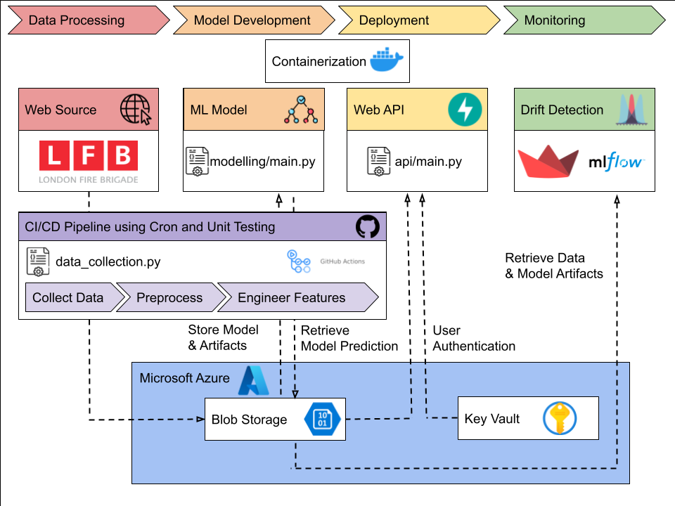
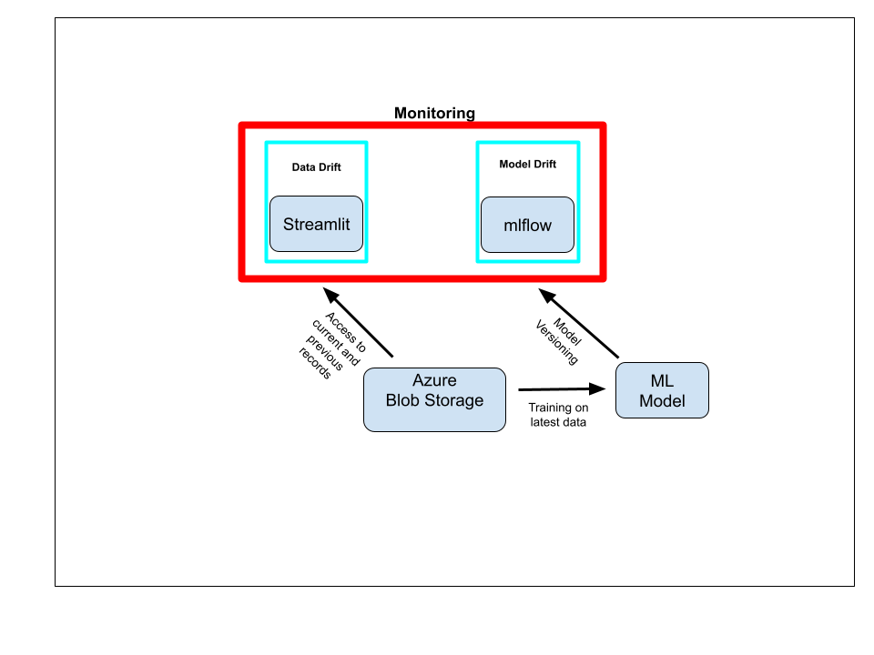
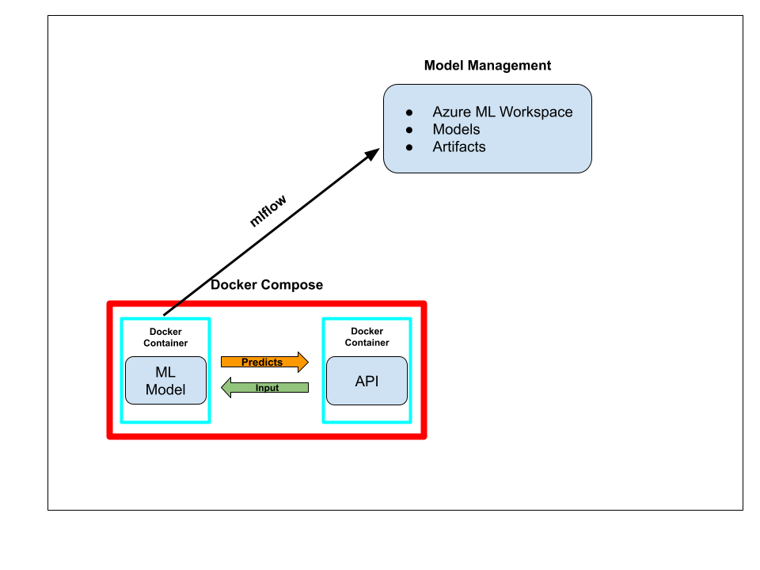

# MLOPS  - Firefighter's Response Time Prediction 
This is the repository for our group project in the MLOps Training.

## GETTING STARTED
## PREREQUISITES
----------------
This project involves development using Python `3.10` version. To get started, follow these steps:

1. Install the required dependencies:

   ```bash
   pip install -r requirements.txt
   ```

### Docker Setup

To simplify the deployment of the project, Docker containers can be used. Here's how to set up and run the project using Docker:

1. **Install Docker and Docker Compose**: Download and install Docker for your system by following the instructions on the [Docker website](https://www.docker.com/get-started).

2. **Clone the Repository**: Open a terminal and clone the repository:

   ```bash
   git clone https://github.com/MLOpsGDA/mlops_fire_fighter.git
   cd mlops_fire_fighter
   ```

3. **Configure `.env` File**: Create a `.env` file in the root directory of the project, contact the project team and request the required permissions and credentials for authentication into Azure. Then paste these credentials in the .env environment variables file

4. **Build and Run the Docker Containers**: In the root directory of the project, run the following command to build and start the Docker containers defined in the `docker-compose.yml` file:

   ```bash
   docker-compose up -d
   ```

   This command will create and start containers for both the modeling and API services.

5. **Access the Services**: Once the containers are up and running, one can access the API service by navigating to `http://localhost:8000` in your web browser. One can also interact with other services as defined in the project.

6. **Stop the Containers**: To stop the containers and remove them, run:

   ```bash
   docker-compose down
   ```

Using Docker containers with `docker-compose` simplifies the process of setting up and running your project. It ensures that dependencies are isolated and provides consistent behavior across different development environments.
 
### API ENDPOINT

If you prefer to integrrate the prediction functionality into your own applications, you can use the provided API endpoint:
 - **Endpoint**: ``http://localhost:8000/predict``
 - **Method**: POST
 - **Request Body**:
 
 ``{
    "HourOfCall": 0,
    "IncidentGroup": "Fire",
    "StopCodeDescription": "Primary Fire",
    "PropertyCategory": "Road Vehicle",
    "PropertyType": "House - single occupancy",
    "AddressQualifier": "Within same building",
    "ProperCase": "Ealing",
    "IncGeo_WardName": "WEST END",
    "NumStationsWithPumpsAttending": 2.0,
    "NumPumpsAttending": 3.0,
    "NumCalls": 4.0,
    "DateOfCall_Month": 6,
    "PartOfDay": "Night",
    "NationalCost": 2000.0
    }
 ``
 - **Response**:

 ``{
    "Predicted Response Time is": [
    5.632224470063445
    ]
 }
 ``


## DIRECTORY SETUP
This repository contains the necessary code for the project's life cycle. The folder structure with the most relevant files is demonstrated below:

    ├── api 
    │    ├── Dockerfile
    │    ├── main.py
    │    ├── pipe.pkl
    │    ├── requirements.txt
    │    └── best_model_2023-xx-xx.pkl
    ├── data
    │    ├── .gitattributes
    │    ├── train.parquet
    │    ├── test.parquet
    │    └── ...
    ├── experiments
    │    ├── EDA.ipynb
    │    ├── blob_storage.ipynb
    │    ├── data_preproceesing.ipynb
    │    └── model_v1.ipynb
    ├── modeling
    │    ├── mlruns
    │    │    └── ...
    │    ├── utils_modeling
    │    │    ├── model_pipeline.py
    │    │    ├── train_predict_model.py
    │    │    └── ...
    │    ├── Dockerfile
    │    ├── main.py
    │    ├── requirements.txt
    │    └── …
    ├── streamlit
    │    ├── helpers.py
    │    ├── streamlit_app.py
    ├── utils
    │    ├── tests
    │    │    ├── test_data_collection.py
    │    │    ├── test_helpers.py
    │    │    ├── test_model_pipeline.py
    │    │    ├── test_train_predict_model.py
    │    │    └── ...
    │    ├── data_collection.py
    │    ├── helpers.py
    │    ├── model_pipeline.py
    │    ├── train_predict_model.py
    │    └── ... 
    ├── .github/workflows
    │    ├── collect_data.yml
    │    └── main.yml
    ├── config.yml
    ├── docker-compose.yml
    ├── README.md
    ├── requirements.txt
    └── ...   

## PROJECT SPECIFICATIONS

### MOTIVATION AND USE CASE

In our MLOps training from DataScientest, we chose the topic "Predicting Firefighter Response Time" as a project to put our learned knowledge into practice. Our goal is to automate the deployment of a Machine Learning model using the MLOps paradigm by automating the complete steps of the "ML" workflow. The application we developed is based on modern standards of a microservice architecture. 

[comment]: <> (We consider advanced Python programming methods in our applications, providing a secure API, orchestrating and automating necessary tasks within applications, and monitoring, operationalising, and managing our ML model in production.)

Our application is designed for use in local fire departments. Thereby, the application is designed for the fire department operator or the emergency call handler. For example, when a person in distress calls the emergency number for acute medical or fire emergencies, they are transferred to the operator who then asks questions so help can be organised. The operator then inquires about the details, where the emergency is located, and the reason for the call. At the end of the telephone assessment, the operator can call our service and retrieve a prediction of response time based on the information provided by the caller. 

Our current use case for this relates to the London Fire Brigade, as this provides a particularly good training dataset.

### CONTEXT AND OBJECTIVE
The primary objective of this project is to address the critical need for accurate response time forecasting, enabling the optimization of resource allocation and improved emergency response strategies.

In this setting, we operate under the assumption that this predictive system is sponsored and commissionned by the London Fire Brigade, aiming at better allocating resources and manpower to respond to quickly developping crises situations in London. The application aims to tackle the challenge of effectively deploying firefighting resources by predicting the time it takes for firefighters to reach the scene of an incident. By providing actionable insights, London decision-makers can enhance emergency response coordination and minimize response time delays.

Once the ML model is trained, it will be deployed into a production environment, accessible through an API. This will enable stakeholders to input incident details and receive real-time predictions of firefighters' response time. Regular monitoring and maintenance of the deployed model will ensure its continued accuracy and reliability, accounting for any shifts or anomalies in the data patterns.

For the purposes of this app, we have identified the following requirements:
 - tailored to the London situation: this means that we will train our model on historic London data
 - strict security and privacy: as there may be real addresses in the incident records, we need to make sure that the app and predictions are only usable and readable by the appropriate public
 - continuous improvement and performance tracking: as this app will be used to save as many lives as possible, it will be necessary to keep track of the performance and maintain to the highest possible level. Continuous monitoring and improvement is therefore a key requirement in this project.


### DATA
To model firefighter response time, we use the publicly available [London Fire Brigade Incident Records](https://data.london.gov.uk/dataset/london-fire-brigade-incident-records). The incident records provide details of each incident in which the LFB has been involved since January 1, 2009. It indicates when and where the incident occurred and what type of incident it was. For our purposes, we limit the focus to the smaller incidents dataset, which includes incidents managed by the LFB for the last three years from May 1, 2020 to April 30, 2023. According to the LFB, the mobilisation records dataset is updated monthly and the incidents dataset quarterly. 
The latest 12 months are used for testing, the 24 months preceding those 12 are used for training, so as to keep with the latest trends in the data and minimise the effects of data drift on the model.


### MACHINE LEARNING - MODELLING, ASSUMPTION AND CHOICES
The machine learning (ML) model uses the LightGBM, XGBoost, and Random Forest algorithms to predict the response time of firefighters arriving at an incident location. 

**Approach:**
1. The script starts by setting up the environment, including setting the date for tracking models and specifying the directory for saving MLflow experiment logs.
2. It defines an experiment named "FireFighter" within MLflow, creating it if it doesn't exist already. This experiment is used to track different runs of the modelling process.
3. The script reads training and testing data from Parquet files.
4. It defines various feature sets, including the target feature ("FirstPumpArriving_AttendanceTime_min"), features to drop, categorical features ("cat_features"), numerical features ("num_features"), and an ID feature ("IncidentNumber").
5. The dropped features are removed from both the training and testing datasets, and the datasets are prepared for modelling by splitting them into features and target variables.
6. The script defines a list of algorithms to try: LightGBM, XGBoost, and Random Forest. It then loops through these algorithms to train models, make predictions, and evaluate their performance.
7. For each algorithm, a model pipeline is created using the "get_pipeline" function, and the model is trained using the "train_model" function. Predictions are made on the testing data using the "predict_model" function.
8. The root mean squared error (RMSE) of the predictions is calculated and compared to find the best algorithm based on the lowest RMSE.
9. The best model is trained again using the chosen algorithm and saved to a pickle file.

**Choice of Algorithm:**
The script tries three popular algorithms: LightGBM, XGBoost, and Random Forest. It evaluates the performance of each algorithm based on the RMSE of the predictions on the testing data. The algorithm with the lowest RMSE is selected as the best algorithm for making predictions.

LightGBM    | Random Forest    | XGBoost
:----------:|:------------:|:-------------:
      |       | 

**Assumptions:**
1. The script assumes that the Parquet files containing the training and testing data are present in specific directories.
2. It assumes that the target variable is "FirstPumpArriving_AttendanceTime_min," and the goal is to predict this value.
3. The script assumes that certain features listed in "drop_features" are not relevant and should be removed from the dataset.
4. It assumes that the best algorithm is the one that produces the lowest RMSE on the testing data.
5. The script assumes that there's an MLflow experiment named "FireFighter" to track different runs and experiments.


## ARCHITECTURE AND OVERALL STRUCTURE




### API

Our approach uses the FastAPI framework and integrates various functionalities such as handling authentication, loading a trained model, receiving prediction requests, and storing request and response data in Azure Blob Storage.


**Design Logic and Structure:**
1. The script starts by importing the necessary libraries and modules, including FastAPI, Azure SDKs, and others.
2. It loads configuration details from a `config.yml` file, including Azure Blob Storage settings, API paths, directory paths, and more.
3. The script establishes connections to Azure services using appropriate credentials.
4. A dictionary of authorised users and their passwords is created and retrieved from Azure Key Vault.
5. The FastAPI application is defined, including its metadata and authentication using HTTPBasic credentials.
6. The trained machine learning model (pipeline) is loaded from a pickle file named `best_model_{today}.pkl`.
7. A Pydantic model class `PredictionPayload` is defined to structure the request payload for predictions.
8. An authentication function `authenticate_user` verifies user credentials against the authorised users dictionary.
9. Several FastAPI endpoints are defined:
   - A root endpoint (`/`) to confirm that the API is working.
   - A `/predict` endpoint for making predictions. It takes in a payload, performs predictions using the loaded model, and stores request and response data in Azure Blob Storage.
10. Any request and response to and from the `/predict` endpoint are saved to our Azure Blob Storage.

**Authorization & Authentication**

So far, only authorised users are allowed to submit a request and receive a well-formed response from the asset. In our case, authenticated users are authorised, there are not any levels of authorizations. 
First, the user needs to have a username and password, which are stored in Azure Key Vault. This Key Vault is a cloud service that provides encryption and protection  for data and secrets in the cloud. 
Then, when the asset is launched, the user enters his/her credentials which are then compared to those stored in the Key Vault. If the credentials exist, the user will be allowed to enter or submit a request and receive a well-formed response.
 

### DOCKER CONTAINERS


**API Docker Container:**

The Dockerfile is used to create a Docker container that runs the FastAPI application. The steps are as follows:
1. The base image is set to the official Python 3.10 image.
2. The working directory is set to `/app/api` inside the container.
3. Necessary files (`main.py`, `best_model_{today}.pkl`, and `requirements.txt`) are copied into the container.
4. Dependencies specified in `requirements.txt` are installed.
5. Port 8000 is exposed for the FastAPI server to listen on.
6. The FastAPI server is run with the `uvicorn` command, specifying the `main:app` module, host as `0.0.0.0`, and port as `8000`.

**Model Docker Container:**

This Dockerfile is used to create a Docker container for running a machine learning model service. The container is based on the official Python 3.10 image and is designed to encapsulate the necessary environment and files required for running the model service. 

1. The base image is set to the official Python 3.10 image.
2. The working directory inside the container is set to `/app/modeling`.
3. Essential files and directories are copied into the container:
   - `main.py`: The main script responsible for executing the modeling service.
   - `Dockerfile`: The Dockerfile itself (optional).
   - `requirements.txt`: A file containing the dependencies required for the modeling service.
   - `utils_modeling`: A directory containing utility modules and scripts related to the modeling service.
4. Dependencies specified in `requirements.txt` are installed using `pip`. The `--no-cache-dir` flag is used to prevent caching of the downloaded packages, which helps keep the image size smaller.
5. The entry point for the container is set to run the `main.py` script using the Python interpreter. This means that when the container starts, it will execute the modeling service defined in `main.py`.

**Docker Compose File:**

The `docker-compose.yml` file is used to define and manage the deployment of two services: `modeling` and `api`. These services are deployed using Docker Compose, a tool for defining and running multi-container Docker applications. 

1. `modeling`:
   - It is built using the Dockerfile located in the `./modeling` directory.
   - The `volumes` directive mounts the `./data` directory from the host into the `/app/data` directory inside the container. This allows data to be shared between the host and the container.
   
2. `api`:
   - It is built using the Dockerfile located in the `./api` directory.
   - The `ports` directive maps port `8000` on the host to port `8000` inside the container, enabling communication with the FastAPI application.
   - The `volumes` directive mounts the `./data` directory from the host into the `/app/data` directory inside the container. Additionally, it mounts the `./config.yml` file from the host into the `/app/config.yml` file inside the container with read-only access. This allows sharing of data and configuration files.
   - The `env_file` directive loads environment variables from the `.env` file on the host and makes them available to the container.
   - The `depends_on` directive ensures that the `modeling` service is started before the `api` service, and it only starts the `api` service if the `modeling` service completes successfully.

This `docker-compose.yml` file defines two services that work together: the `modeling` service and the `api` service. The `modeling` service is built from the `./modeling` directory, and the `api` service is built from the `./api` directory. These services share data through mounted volumes and can be orchestrated using Docker Compose commands, simplifying the deployment and management of the application.

### MONITORING - DATA AND MODEL
We use Streamlit to monitor the current and previous datasets used to train our machine learning model and to detect data discrepancies. In doing so, the Streamlit app considers the following steps:

1. **Data Description:**

One page of the Streamlit app contains a metadata description of the variables we use in our model to predict firefighter response time. This contains the name of the variables, a short description and their data types.

2. **Data Drift:**

Subsequently, one of the variables can be compared:
- Numerical variables can be analyzed using a kernel density estimation (KDE) plot and a two-tailed t-test and a Kolmogorov-Smirnov test.
- Categorical variables can be analyzed using a count plot and a chi-square independence test via a Kolmogorov-Smirnov test.

3. **Deployment:**

The app is deployed via Streamlit Community Cloud and can be accessed at the following link: https://mlopsfirefighter.streamlit.app/. Note that secrets can be stored directly on the platform and then read in as environment variables within the app.

**Monitoring overview**



The machine learning model leverages MLflow to track and manage experiments and their associated artifacts. The following steps are considered and covered:

1. **Experiment Tracking:**
   - MLflow is used to track experiments and their associated metadata.
   - An experiment named "FireFighter" is created or retrieved using the experiment name.
   - The experiment ID is obtained for later use in run tracking.

2. **Data Preparation:**
   - Training and testing data are read from Parquet files.
   - Features are defined, including target, drop features, categorical features, numerical features, and an ID feature.
   - Unwanted features are dropped from the data.
   - Data is split into features and target variables for both training and testing datasets.

3. **Model Training and Evaluation:**
   - Different algorithms (LightGBM, XGBoost, Random Forest) are tried.
   - For each algorithm, a model pipeline is created using the defined features and the selected algorithm.
   - Models are trained and evaluated using the pipeline.
   - The algorithm with the lowest RMSE is selected as the best algorithm.
   - The best model is trained again using the best algorithm.

4. **Artifact Storage:**
   - The best model is saved as a pickle file with the current date in its name.
   - Metrics and parameters are logged to the MLflow run.

5. **MLflow Tracking:**
   - MLflow's run is started within the experiment identified by the experiment ID.
   - Parameters like `max_depth`, `num_leaves`, `n_estimators`, and `best_algorithm` are logged.
   - Metrics such as RMSE, MAE, and MSE are logged.
   - The best model is logged using the `mlflow.sklearn.log_model` function.

**Mlflow overall schematic view**


In summary, the MLflow utilizes to manage and track experiments, as well as to log various aspects of the modeling process, including parameters, metrics, and the trained model itself. This provides a structured approach to conducting machine learning experiments, capturing their details, and allowing easy comparison of different algorithm performances.


### CLOUD SERVICE USAGE - AZURE
In this project, we extensively used Azure and different services that it offers. Embedding a cloud service in our asset made it more robust and flexible.


#### BLOB STORAGE
The most important service that we use is the Blob Storage. It is a cloud storage space designed by Microsoft Azure designed to store and process massive amounts of data.
In the blob storage, we automatically upload data at regular intervals, keep track and version of the training and testing dataset and meticulously store any request made to the API as well the corresponding response. The directory structure with the most relevant files is demonstrated below:

    ├── api 
    │    ├── requests
    │    │    └── ...
    │    ├── responses
    │    │    └── ...
    │    ├── input_output_{date}.json
    │    └── ...
    ├── oldies
    │    └── ...
    ├── test
    │    ├── old
    │    │    └── ...
    │    └── test.parquet
    ├── train
    │    ├── old
    │    │    └── ...
    │    └── train.parquet
    ├── train
    │    ├── old
    │    │    └── ...
    │    └── train.parquet
    ├── LFB Mobilisation ... .zip
    └── newest_table.parquet

#### AZURE KEY VAULT
Azure Key Vault is a cloud-based service provided by Microsoft Azure that helps organisations manage cryptographic keys, secrets, certificates, and other sensitive information used in their applications and services. It provides a secure and centralised repository for storing and controlling access to these critical assets, enabling secure application development and deployment. Azure Key Vault offers features such as hardware security module (HSM) support, access policies, versioning, and auditing to enhance data security and compliance. It's a fundamental component for safeguarding sensitive data in cloud environments and ensuring proper management of encryption keys and secrets.
In our case, we use Azure Key Vault for the storage and encryption of our API credentials.


### CI/CD AND SCHEDULED JOBS
The tool we use for CI/CD in this project is GitHub actions, by which our tests and integration of new capacities take place. CI/CD with GitHub Workflows involves using GitHub's built-in automation platform to automate the integration, testing, and deployment of code changes. Developers define workflows using YAML files within their GitHub repositories. When code changes are pushed or pull requests are made, GitHub Workflows automatically trigger predefined actions, such as running tests, building applications, and deploying to specified environments. This ensures that code is continuously integrated, tested, and deployed, reducing manual intervention, enhancing collaboration, and facilitating a seamless and efficient software development lifecycle.

To ensure that the latest data is permanently available to us, we designed a scheduled workflow to regularly download the latest table from the London Fire Brigade website and upload to our Blob Storage. It also works via a GitHub workflow, and a cron syntax specifies that it should run every Sunday at 00:00 (GMT).


### OVERALL VIEW


## DESCRIPTION
Descriptions of the folders and the files are given below:

API Folder: The 'api' folder contains files related to the API service for the project:

api/Dockerfile

This Dockerfile is used to create a container for the API service. It's based on the official Python 3.10 image and sets up the working directory, copies essential files (main.py, best_model_2023-xx-xx.pkl, requirements.txt), installs dependencies, exposes port 8000, and starts the FastAPI server.

api/main.py

This Python script defines the FastAPI application for the MLOpsGDA API. It includes endpoints for basic functionality and prediction of response times. The app is tagged with 'Home' and 'Predictions' for OpenAPI documentation. The script handles user authentication and loads the machine learning model to make real-time predictions.

api/pipe.pkl

This file contains a stored machine learning pipeline model used for predicting response times.

api/best_model_2023-xx-xx.pkl

This file holds the best-predicted machine learning model for response time prediction.

api/requirements.txt

This file lists the required Python packages and their versions necessary for the API service to function correctly.

Data Folder: The 'data' folder contains files related to the dataset used in the project:

data/.gitattributes

This file is used to manage the Git Large File Storage (LFS) for versioning large files like datasets. It specifies that the train.pkl file should be tracked using LFS.

data/train.parquet

This file contains the prepared training data. It is a Parquet file format that holds the dataset used for training machine learning models within the project.

data/test.parquet

This file contains the prepared test data. Similar to train.parquet, this Parquet file format holds the dataset used for testing and evaluating machine learning models.

These files collectively provide the essential data required for training, testing, and evaluating machine learning models in the project.

Experiments Folder: The 'experiments' folder houses notebooks and scripts used for different experiments and analyses in the project:

experiments/EDA.ipynb

This notebook contains Exploratory Data Analysis (EDA) for understanding the project's data. It provides insights into the data's distribution, patterns, and initial observations, aiding in the development of informed models.

experiments/blob_storage.ipynb

This notebook demonstrates code snippets for interacting with Azure Blob Storage. It showcases how to authenticate, access, and process files from Azure Blob Storage. The provided code is essential for handling data storage and retrieval within the project.

experiments/data_preprocessing.ipynb

This notebook covers the data preprocessing steps involved in the project. It outlines how data is cleaned, transformed, and prepared for model training. Data preprocessing is a crucial phase that ensures the quality and relevance of input data for machine learning models.

experiments/model_v1.ipynb

This notebook presents the initial version of the machine learning model. It encompasses the model's architecture, training process, and preliminary evaluation. This version often serves as a baseline for comparison and improvement in later iterations.

These notebooks collectively document various stages of experimentation, from data understanding and preparation to model development.

Modeling Folder: The 'modeling' folder contains files and sub-folders related to modeling and machine learning processes:

modeling/mlruns

This folder is dedicated to MLflow, a platform for managing the machine learning lifecycle. It's used to track and log the results, parameters, and artifacts of various model runs, providing a comprehensive record of model experiments.

modeling/utils_modeling

The 'utils_modeling' sub-folder holds utility scripts essential for model creation and evaluation:

modeling/utils_modeling/model_pipeline.py

This script defines a utility function named get_pipeline(). This function returns a machine learning pipeline based on the selected algorithm (options: 'lgbm', 'xgboost', or 'rf'). It constructs a preprocessing pipeline and an estimator pipeline, which can include hyperparameter tuning using either grid search or custom hyperparameters.

modeling/utils_modeling/train_predict_model.py

This script includes two functions: train_model() and predict_model(). These functions are used to train a model using a provided pipeline and evaluate the model's performance. The train_model() function trains the model using the training dataset, while the predict_model() function predicts on a test dataset and returns evaluation metrics like Mean Squared Error (MSE), Mean Absolute Error (MAE), and Root Mean Squared Error (RMSE).

modeling/Dockerfile

This Dockerfile is used for containerization of the modeling service. It defines the base image, sets the working directory inside the container, copies the necessary files, installs dependencies, and specifies the entry point for running the main.py script.

modeling/main.py

This script orchestrates the model training and evaluation process. It imports utility functions from utils_modeling, such as get_pipeline(), train_model(), and predict_model(). The script performs the following steps:

Loads MLflow tracking settings and sets the experiment name.
Reads the training and testing datasets from the 'data' folder.
Defines target, drop, categorical, numerical, and ID features.
Prepares modeling datasets by dropping irrelevant features.
Tries different algorithms (e.g., 'lgbm', 'xgboost', 'rf') to find the one with the lowest RMSE.
Saves the best model and logs relevant metrics using MLflow.
modeling/requirements.txt

This file lists the required Python packages necessary for running the modeling service. It includes libraries like MLflow, LightGBM, XGBoost, Pandas, Scikit-Learn, and Tubular, which are essential for various modeling and evaluation tasks.

modeling/utils_modeling

This sub-folder contains utility scripts essential for the model building process:

modeling/utils_modeling/model_pipeline.py

This script defines the get_pipeline() function that constructs a machine learning pipeline based on specified algorithm options. The pipeline includes preprocessing steps and an estimator, and it supports hyperparameter tuning through grid search or custom hyperparameters.

modeling/utils_modeling/train_predict_model.py

This script includes the train_model() and predict_model() functions. These functions are used for training a model and predicting on test data, respectively. They also calculate evaluation metrics such as RMSE, MAE, and MSE to assess model performance.

Collectively, these files and sub-folders within the 'modeling' directory provide the infrastructure and processes needed for model creation, training, evaluation, and tracking.

Utils Folder: The 'utils' folder contains utility scripts and modules that support various functionalities of the emergency incident data processing and modeling pipeline:

utils/tests

This sub-folder holds unit test scripts that validate the functionality of different components within the project. The unit tests ensure the correctness of the implemented functions and help identify issues early in the development process.

utils/tests/test_data_collection.py

This unit test script verifies the data collection process by checking if new data is available, if older dataframes are accessible, and if the schema consistency is maintained across different data versions.

utils/tests/test_helpers.py

This unit test script tests the utility functions defined in the helpers.py module. It includes tests for preprocessing date and time columns, as well as calculating attendance time based on specific time intervals.

utils/tests/test_model_pipeline.py

This unit test script assesses the construction of machine learning pipelines using the model_pipeline.py module. It covers scenarios where pipelines are built using algorithms like LightGBM, XGBoost, and RandomForest, ensuring their correct initialization and hyperparameter settings.

utils/tests/test_train_predict_model.py

This unit test script validates the train_model() and predict_model() functions from the train_predict_model.py module. It ensures that models are trained correctly and predictions are made accurately, with metrics such as MSE, RMSE, and MAE calculated and assessed.

utils/helpers.py

This module includes utility functions that facilitate common data preprocessing and transformation tasks necessary for the modeling process. These functions are used to handle date and time columns, preprocess categorical features, and calculate attendance time.

utils/model_pipeline.py

This module defines the get_pipeline() function responsible for constructing machine learning pipelines. The pipelines encompass preprocessing steps and an estimator, with the flexibility to choose algorithms such as LightGBM, XGBoost, or RandomForest. Hyperparameters can be tuned through grid search or custom settings.

utils/train_predict_model.py

This module contains functions essential for training and evaluating machine learning models. The train_model() function trains a model using the specified pipeline and training data. The predict_model() function uses the trained model to predict on test data and calculates key evaluation metrics.

Collectively, these files and sub-folders within the 'utils' directory provide the core utility functions, testing infrastructure, and machine learning pipeline construction necessary for the emergency incident data processing and modeling pipeline.

.github/workflows Folder: The .github/workflows folder contains workflow configuration files that define the automated processes and tasks for data collection, testing, and continuous integration/continuous deployment (CI/CD) of the emergency incident data processing and modeling pipeline:

.github/workflows/collect_data.yml

This workflow file orchestrates the scheduled data collection process from the emergency incident data source. Furthermore, it automates the collection of emergency incident data on a scheduled basis and ensures that the data processing pipeline stays up-to-date.

.github/workflows/main.yml

This workflow file establishes the continuous integration and continuous deployment (CI/CD) process triggered by pushes to the main branch. This workflow automates the testing and deployment process for the emergency incident data processing and modeling pipeline. It ensures that the codebase remains stable and consistent across different stages of development.

Configurations and Docker Setup: The repository includes configuration files and a Docker setup that are essential for managing data sources, environment variables, and deployment:

config.yml

The config.yml file contains essential configuration parameters for the emergency incident data processing and modeling pipeline. This file centralizes the configuration settings for data sources, API directories, and key vault credentials, ensuring consistency and manageability.

docker-compose.yml

The docker-compose.yml file defines the services and their configuration for the Docker containers used in the emergency incident data processing and modeling pipeline. This file sets up the Docker containers for the modeling and API services, ensuring that data volumes and configurations are appropriately mapped.

README.md

The README.md file itself serves as the main documentation for the emergency incident data processing and modeling pipeline. It includes descriptions, instructions, and explanations to guide users and developers through the setup, usage, and maintenance of the project.

requirements.txt

The requirements.txt file lists the required Python packages necessary for running the emergency incident data processing and modeling pipeline. These libraries include dependencies for data manipulation, machine learning, testing, and Azure integration.

## CONCLUSION
By ingeniously fusing advanced machine learning methodologies with the robust containerization capabilities of Docker, this application not only augments the predictive prowess of firefighting operations but also epitomizes the seamless integration of theoretical principles into tangible, real-world solutions.

Furthermore, the utilization of Docker containers underscores the pragmatism and scalability requisite for contemporary software deployments. By encapsulating the app within a harmonious container ecosystem, we embrace the tenets of consistency, isolation, and portability, thereby furnishing an infrastructure that can seamlessly adapt to varying computational landscapes and user demands.
